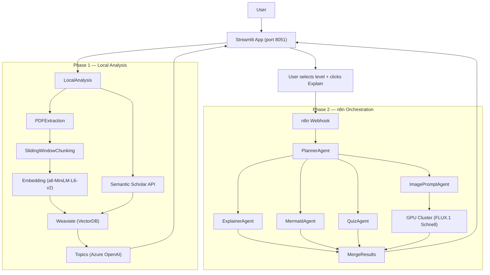

# ARPX: Adaptive Research Paper Explainer

**INF-3600 Generative AI — UiT The Arctic University of Norway, Spring 2026**

ARPX is a multi-agent, Retrieval-Augmented Generation (RAG) system that acts as an adaptive tutor for academic research papers. It analyzes a PDF, indexes it alongside its cited references, and produces an explanation calibrated to the reader's stated knowledge level (1–10).

## Features

- **PDF upload and analysis** — extract text, chunk with sliding window, embed, and store in Weaviate
- **Reference indexing** — fetch cited papers via Semantic Scholar and index them alongside the main paper
- **Adaptive explanations** — 10 distinct knowledge levels with per-level system prompts
- **Planner-coordinated agents** — a PlannerAgent generates a coordination brief shared by all downstream agents for thematic cohesion
- **Mermaid diagrams** — structural/logical visualization of the paper (mindmap, flowchart, or sequence diagram)
- **Visual analogy images** — FLUX.1 Schnell on GPU cluster generates a conceptual metaphor image
- **Comprehension quiz** — multiple-choice quiz calibrated to the reader's level
- **Text-to-speech** — Piper CPU-based narration of the explanation
- **Follow-up chat** — RAG-powered conversation with Reciprocal Rank Fusion retrieval
- **Explanation history** — SQLite persistence with full session restore

## System architecture



The system has four components:

- **Streamlit app** — file upload, level selection, explanation display, quiz, TTS, chat
- **Weaviate** — vector database storing paper and reference embeddings
- **n8n** — orchestrates six LLM agents (Planner, Explainer, Mermaid, Quiz, ImagePrompt, Chat)
- **Image service** — FastAPI on ificluster GPU node running FLUX.1 Schnell

## Setup

### Prerequisites

- Docker and Docker Compose
- Azure OpenAI API key (UiT course deployment)

### Step-by-step

1. **Configure environment variables**

   ```bash
   cp .env.example .env
   # Edit .env with your Azure OpenAI credentials
   ```

2. **Start the Docker stack**

   ```bash
   docker compose up --build
   ```

   This starts three containers: `app` (Streamlit on port 8051), `weaviate` (port 8080), and `n8n` (port 5678).

3. **Import the n8n workflow**

   Open http://localhost:5678, then: **Workflows** → **Import from File** → select `n8n_workflows/arpx-mvp.json`.

4. **Add Azure OpenAI credentials in n8n**

   **Credentials** → **Add Credential** → **Header Auth** with name `api-key` and your Azure key as the value. Assign this credential to all six LLM nodes: `PlannerAgent`, `ExplainerAgent`, `MermaidAgent`, `QuizAgent`, `ImagePromptAgent`, `ChatAgent`.

5. **Publish the workflow**

   In the n8n workflow editor: click **Publish**.

6. **Open the application**

   Navigate to http://localhost:8051.

7. **Start the GPU image service**

   See [`image_service/README.md`](image_service/README.md) for setting up FLUX.1 Schnell on ificluster.

### Environment variables

| Variable | Purpose |
|----------|---------|
| `AZURE_OPENAI_KEY` | API key for Azure OpenAI |
| `AZURE_OPENAI_ENDPOINT` | Base URL of the Azure OpenAI resource |
| `AZURE_OPENAI_DEPLOYMENT` | Deployment name (e.g. `gpt-5-chat`) |
| `AZURE_OPENAI_API_VERSION` | Optional; defaults to `2024-10-21` |

## How it works

### Phase 1: Analyze (local, no n8n)

1. User uploads a PDF. Text is extracted with PyMuPDF.
2. Text is chunked using a sliding window (300 words, 50-word overlap).
3. Chunks are embedded with `all-MiniLM-L6-v2` and stored in Weaviate as `source="main"`.
4. References are extracted from the bibliography, fetched via Semantic Scholar, and indexed as `source="reference"`.
5. Top-4 main + top-1 reference chunks are retrieved and sent to Azure OpenAI to extract topic bullets.

### Phase 2: Explain (calls n8n)

1. Health check (ping) to n8n — abort if unreachable.
2. Top-4+1 chunks are retrieved and POSTed to n8n.
3. n8n runs: **PlannerAgent** → (**ExplainerAgent** + **MermaidAgent** + **QuizAgent** + **ImagePromptAgent** → **CallClusterAPI**) in parallel → merge results.
4. Results are saved to SQLite and displayed in Streamlit.

### Phase 3: Chat (calls n8n)

1. User types a follow-up question.
2. Three reformulations of the question are sent to Weaviate; results are merged with Reciprocal Rank Fusion (RRF) for better recall than a single query.
3. Chunks + conversation history are POSTed to n8n's chat stage.
4. Response is displayed and persisted.

## Evaluation

The project includes an automated evaluation and prompt optimization pipeline. See [`evals/README.md`](evals/README.md) for full details.

Highlights:
- LLM-as-judge rubric with 4 dimensions (faithfulness, level_match, coverage, clarity)
- Deterministic Mermaid diagram grading (5 binary rules)
- Multi-model comparison (gpt-5-chat, Llama-4-Maverick, mistral-Large-3)
- Inter-judge agreement analysis (Spearman correlation)
- DSPy COPRO prompt optimization
- Chunking strategy comparison and RAG type experiments

Results are documented in [`evals/FINDINGS.md`](evals/FINDINGS.md).

## Detailed setup docs

- n8n workflow and prompts: [`n8n_workflows/README.md`](n8n_workflows/README.md)
- GPU image service: [`image_service/README.md`](image_service/README.md)
- Evaluation pipeline: [`evals/README.md`](evals/README.md)

## AI assistance attribution

Development assisted by AI tools: Cursor (Claude Sonnet, Composer 2.5 Fast, etc..), Claude Code, and ChatGPT. All code reviewed and edited by team members.
