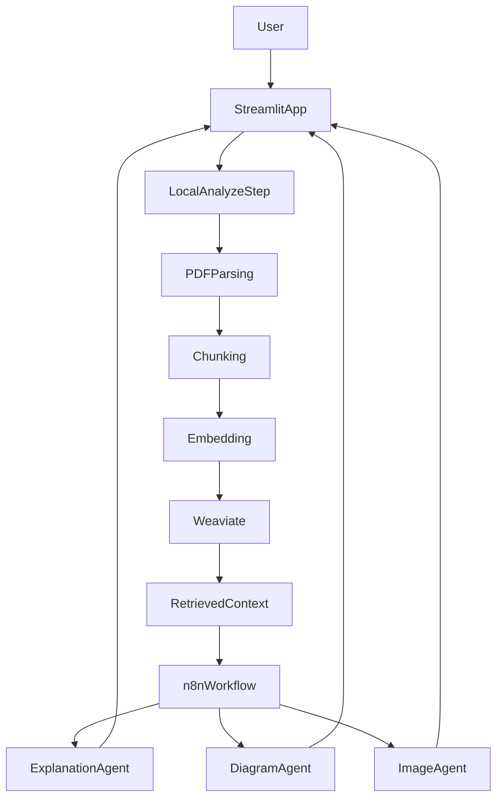

# ARPX: Adaptive Research Paper Explainer

Arpx is a Generative AI system that analyzes resarch papers and generates adaptive explanations based on the user's knowledge level.

The system uses Retrieval-Augmented Generation (RAG), a vector database (Weaviate), and an orchestration layer (n8n) to process and explain academic content. HER: Legg til resten av hva som blir brukt.

## Features
- Upload research papers (PDF)
- Receive the main topics from the paper
- Semantic search using vector embeddings
- Modular architecture with orchestrated agents

## Syetem Arcitecture
The system is composed of x main components:

- Frontend & Application Layer
    - Streamlit app
    - Handles file upload, UI, and user interaction
- Vector Database
    - Weaviate
    - Stores embeddings and enables semantic retrieval
- Orchestration Layer
    - n8n
    - Coordinates LLM calls and generates explanations + diagrams

## Running the Project (Docker)
### Prerequisites
- Docker installed
- Docker Compose installed

1. Start the system
From the project root:

```bash
docker compose up --build
```

2. Open the application
Go to:

http://localhost:8051

3. (Optional) Access Weaviate
http://localhost:8080/v1/meta

## Environment Variables
The following environment variables need to be set:
- OPENAI_KEY
- AZURE_OPENAI_ENDPOINT
- AZURE_OPENAI_DEPLOYMENT

## How it Works
1. User uploads a research paper
2. The paper is processed and split into chunks
3. Embeddings are generated and stored in Weaviate
4. Relevant chunks are retrieved using semantic search
5. The system calls an LLM to find the main topics of the research using the relevant chunks
6. Based on the topics, the user select the knowledge level
7. ...

## Usage

1. Upload a research paper PDF in the Streamlit interface.
2. Click **Analyze Paper** to run local ingestion, indexing, and retrieval context preparation.
3. Choose an explanation level (1-10).
4. Send analysis context to the n8n workflow for explanation and visual generation.
5. Review returned outputs in the interface (adaptive explanation + visuals).

## Architecture Snapshot

Target operating flow:



## Project Status

- Direction locked:
  - Local app handles analysis/preprocessing and retrieval context.
  - n8n workflows own explanation and visual-generation responsibilities.
- Documentation stance:
  - This README describes the target architecture and team direction.
  - Setup details remain split across subsystem docs below.

## Detailed Setup Docs

- n8n workflow setup: [`docs/setup-n8n.md`](docs/setup-n8n.md)
- Weaviate setup: [`docs/setup-weaviate.md`](docs/setup-weaviate.md)

## AI Assistance Attribution

This README was drafted with AI assistance using OpenAI Codex via Cursor, then reviewed and edited by project maintainers.
