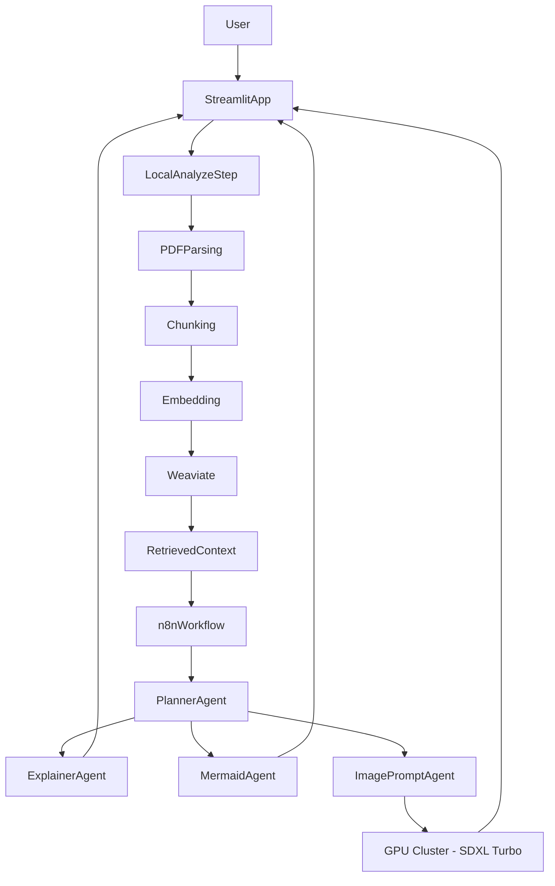

# ARPX: Adaptive Research Paper Explainer

ARPX is a generative AI system that analyzes research papers and produces adaptive explanations based on the reader's chosen knowledge level.

The system uses Retrieval-Augmented Generation (RAG), a vector database (Weaviate), and an orchestration layer (n8n) to process and explain academic content.

## Features

- Upload research papers (PDF)
- Receive the main topics from the paper
- Adaptive explanations across 10 knowledge levels
- Semantic search using vector embeddings (Weaviate)
- RAG-augmented context from main paper + referenced papers (Semantic Scholar)
- Mermaid diagrams for structural/logical visualization
- Visual analogy images via Stable Diffusion (SDXL Turbo on GPU cluster)
- Follow-up chat with conversation history
- Explanation history with SQLite persistence
- Modular multi-agent architecture orchestrated by n8n

## System architecture

The system is composed of three primary components:

- **Frontend & application layer**
  - Streamlit app
  - Handles file upload, UI, and user interaction
- **Vector database**
  - Weaviate
  - Stores embeddings and enables semantic retrieval
- **Orchestration layer**
  - n8n
  - Coordinates LLM agents: Planner, Explainer, Mermaid, ImagePrompt, Chat
- **Image generation service**
  - FastAPI on university GPU cluster (ificluster)
  - SDXL Turbo for visual analogy generation

## Running the project (Docker)

### Prerequisites

- Docker
- Docker Compose
- A populated `.env` file (see [Environment variables](#environment-variables))

### Start the system

From the project root:

```bash
docker compose up --build
```

### Open the application

http://localhost:8051

### (Optional) Access Weaviate

http://localhost:8080/v1/meta

## Environment variables

Copy **`.env.example`** to **`.env`** and fill in the values described there. The application uses:

| Variable | Purpose |
|----------|---------|
| `AZURE_OPENAI_KEY` | API key for Azure OpenAI |
| `AZURE_OPENAI_ENDPOINT` | Base URL of the Azure OpenAI resource |
| `AZURE_OPENAI_DEPLOYMENT` | Deployment name (topic extraction) |
| `AZURE_OPENAI_API_VERSION` | Optional; overrides the default API version in `agents/analyzer.py` if set |

The image service on the GPU cluster uses its own env vars — see [`image_service/README.md`](image_service/README.md).

## How it works

1. User uploads a research paper.
2. The paper is processed and split into chunks.
3. Embeddings are generated and stored in Weaviate.
4. References are fetched via Semantic Scholar and indexed alongside the main paper.
5. Relevant chunks are retrieved using semantic search.
6. The system calls an LLM to find the main topics of the research using the relevant chunks.
7. Based on the topics, the user selects the knowledge level (1–10).
8. The app sends context to n8n, which runs:
   - **PlannerAgent** — creates a coordination brief for cohesion across agents
   - **ExplainerAgent** — generates an adaptive text explanation
   - **MermaidAgent** — generates a structural diagram
   - **ImagePromptAgent** → **GPU cluster** — generates a visual analogy image via Stable Diffusion
9. Results are displayed in the Streamlit interface.
10. User can ask follow-up questions via the chat agent.

## Usage

1. Upload a research paper PDF in the Streamlit interface.
2. Click **Analyze Paper** to run local ingestion, indexing, and retrieval context preparation.
3. Choose an explanation level (1–10).
4. Send analysis context to the n8n workflow for explanation and visual generation.
5. Review returned outputs in the interface (adaptive explanation and visuals).

## Data flow



## Project status

- The local app handles analysis, preprocessing, and retrieval context.
- n8n workflows own explanation and visual-generation responsibilities.
- Setup details for subsystems are in the docs linked below.

## Detailed setup docs

- n8n workflow: [`n8n_workflows/setup-n8n.md`](n8n_workflows/setup-n8n.md)
- Image service (GPU cluster): [`image_service/README.md`](image_service/README.md)

## AI assistance attribution

This README was drafted with AI assistance using OpenAI Codex via Cursor, then reviewed and edited by project maintainers.
