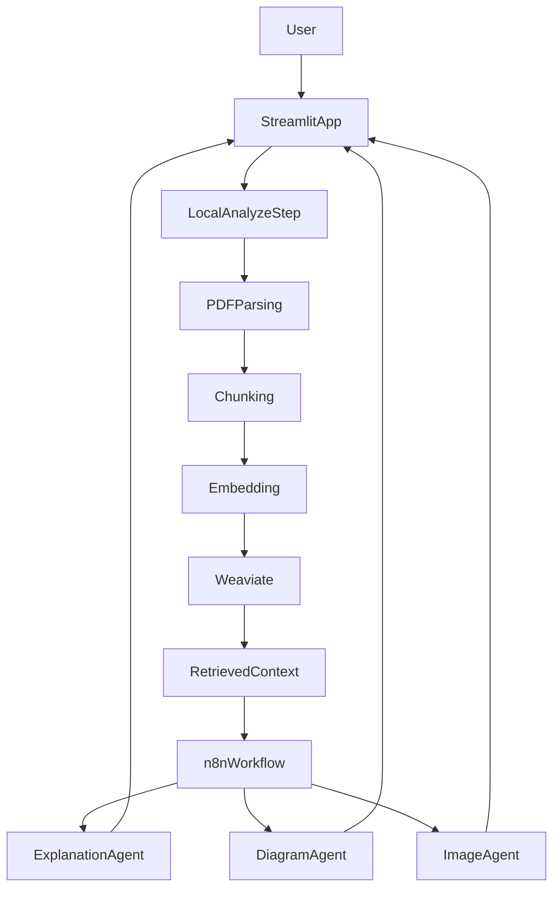

# ARPX: Adaptive Research Paper Explainer

ARPX is a generative AI system that analyzes research papers and produces adaptive explanations based on the reader's chosen knowledge level.

The system uses Retrieval-Augmented Generation (RAG), a vector database (Weaviate), and an orchestration layer (n8n) to process and explain academic content.

## Features

- Upload research papers (PDF)
- Receive the main topics from the paper
- Semantic search using vector embeddings
- Modular architecture with orchestrated agents

## System architecture

The system is composed of three primary components:

- **Frontend & application layer**
  - Streamlit app
  - Handles file upload, UI, and user interaction
- **Vector database**
  - Weaviate
  - Stores embeddings and enables semantic retrieval
- **Orchestration layer**
  - n8n
  - Coordinates LLM calls and generates explanations and diagrams

## Running the project (Docker)

### Prerequisites

- Docker
- Docker Compose
- A populated `.env` file (see [Environment variables](#environment-variables))

### Start the system

From the project root:

```bash
docker compose up --build
```

### Open the application

http://localhost:8051

### (Optional) Access Weaviate

http://localhost:8080/v1/meta

## Environment variables

Copy **`.env.example`** to **`.env`** and fill in the values described there. The application uses:

| Variable | Purpose |
|----------|---------|
| `AZURE_OPENAI_KEY` | API key for Azure OpenAI |
| `AZURE_OPENAI_ENDPOINT` | Base URL of the Azure OpenAI resource |
| `AZURE_OPENAI_DEPLOYMENT` | Deployment name (topic extraction) |
| `AZURE_OPENAI_API_VERSION` | Optional; overrides the default API version in `agents/analyzer.py` if set |

## How it works

1. User uploads a research paper.
2. The paper is processed and split into chunks.
3. Embeddings are generated and stored in Weaviate.
4. Relevant chunks are retrieved using semantic search.
5. The system calls an LLM to find the main topics of the research using the relevant chunks.
6. Based on the topics, the user selects the knowledge level.
7. The app sends context to n8n for explanation and visuals.

## Usage

1. Upload a research paper PDF in the Streamlit interface.
2. Click **Analyze Paper** to run local ingestion, indexing, and retrieval context preparation.
3. Choose an explanation level (1–10).
4. Send analysis context to the n8n workflow for explanation and visual generation.
5. Review returned outputs in the interface (adaptive explanation and visuals).

## Data flow



## Project status

- The local app handles analysis, preprocessing, and retrieval context.
- n8n workflows own explanation and visual-generation responsibilities.
- Setup details for subsystems are in the docs linked below.

## Detailed setup docs

- n8n: [`docs/setup-n8n.md`](docs/setup-n8n.md)

## AI assistance attribution

This README was drafted with AI assistance using OpenAI Codex via Cursor, then reviewed and edited by project maintainers.
