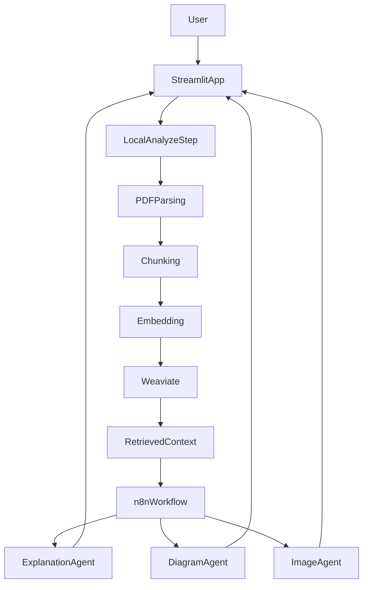

# ARPX: Adaptive Research Paper Explainer

ARPX is a student-built AI system that helps users understand research papers at different knowledge levels. The project direction is local analysis for ingestion/retrieval, with n8n workflows handling explanation and visual generation.

## Highlights

- Adaptive user control: users set explanation depth from level 1-10.
- Local analysis pipeline: uploaded PDFs are parsed, chunked, embedded, and indexed in Weaviate.
- n8n-first orchestration: explanation and visualization are executed through workflow agents.
- Dual output direction: text explanation plus visual artifacts (diagram/image) from the n8n flow.
- Streamlit-first UX: simple upload-and-analyze experience for demos and iteration.

## Overview

This repository contains the ARPX course project scaffold and integration surface between a local analysis backend and workflow-based AI orchestration.  
The intended operating model is: local preprocessing and retrieval context generation, then n8n-managed agent execution for explanation and visuals.

If you are evaluating the project quickly, start with Quickstart and then read the setup docs linked below for specific subsystems.

## Quickstart

### 1) Clone and enter the project

```bash
git clone <your-repo-url>
cd arpx
```

### 2) Create and activate a virtual environment

```bash
python -m venv .venv
source .venv/bin/activate
```

### 3) Install dependencies

```bash
pip install -r requirements.txt
```

### 4) Configure environment variables

Create a `.env` file in the project root for credentials used in your active workflow setup.

For local testing paths, this may include:

```env
OPENAI_API_KEY=your_api_key_here
```

### 5) Ensure Weaviate is available locally

The current code expects Weaviate at `127.0.0.1:8080`.  
See [`docs/setup-weaviate.md`](docs/setup-weaviate.md).

### 6) Run the app

```bash
streamlit run app.py
```

## Usage

1. Upload a research paper PDF in the Streamlit interface.
2. Click **Analyze Paper** to run local ingestion, indexing, and retrieval context preparation.
3. Choose an explanation level (1-10).
4. Send analysis context to the n8n workflow for explanation and visual generation.
5. Review returned outputs in the interface (adaptive explanation + visuals).

## Architecture Snapshot

Target operating flow:



## Project Status

- Direction locked:
  - Local app handles analysis/preprocessing and retrieval context.
  - n8n workflows own explanation and visual-generation responsibilities.
- Documentation stance:
  - This README describes the target architecture and team direction.
  - Setup details remain split across subsystem docs below.

## Detailed Setup Docs

- n8n workflow setup: [`docs/setup-n8n.md`](docs/setup-n8n.md)
- Weaviate setup: [`docs/setup-weaviate.md`](docs/setup-weaviate.md)

## AI Assistance Attribution

This README was drafted with AI assistance using OpenAI Codex via Cursor, then reviewed and edited by project maintainers.
