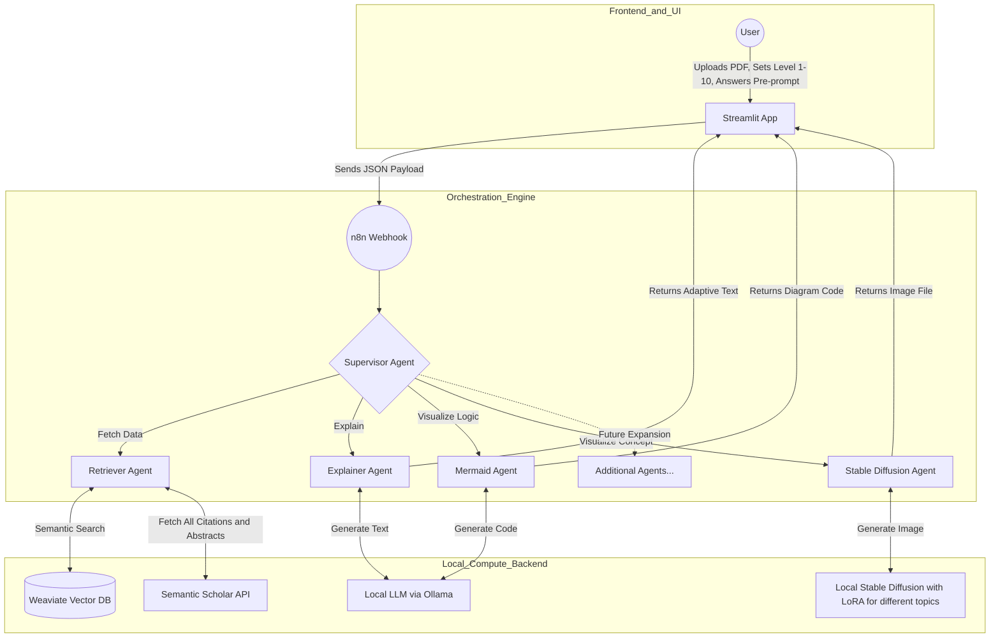

# Project Blueprint: Adaptive Research Paper Explainer (ARPX)

## 1. The Vision

We are building a multi-agent, Retrieval-Augmented Generation (RAG) system that acts as a flexible, adaptive tutor for academic papers across any discipline.

Core capabilities include:

### 1.1 Adaptive Complexity

The system dynamically adjusts explanation depth and vocabulary based on the user's stated background level on a scale from 1 to 10.

Before generating the explanation, the system asks:

How much do you know about these current topics?

This pre-prompt includes the specific core concepts from the paper.

### 1.2 Dual Modality Generation

The system always generates both visual modalities:

- Mermaid.js diagrams for structural and logical insight.
- A conceptual visual metaphor image (for example, a server room) via Stable Diffusion.

### 1.3 Comprehensive Citation Fetching

The system always uses tool-calling with the Semantic Scholar API to gather context from cited papers, extending beyond a single uploaded PDF.

For citations that are unavailable or behind paywalls, the agent extracts the abstract only and clearly states this limitation in the user-facing explanation.

## 2. System Architecture (Local / Asynchronous Execution)

To ensure reliable execution and sovereign data processing, the core inference pipeline runs locally and asynchronously.

## 3. Technical Mapping to Course Resources

The architecture integrates these core technologies from the INF-3600 curriculum:

- Weaviate and RAG (Weeks 6-8): Semantic retrieval over uploaded documents.
- n8n Multi-Agent (Week 8): Workflow orchestration and state management.
- Local Inference (Week 9): Sovereign LLM execution through Ollama.
- Diffusers Library (Weeks 12-13): Local image generation, including topic-specific LoRAs.

## 4. Workload Distribution

Technical domains are divided as follows:

| Role | Responsibilities | Primary Repos/Folders |
|---|---|---|
| Data and RAG Engineer | Parse PDFs, define the Weaviate schema, write Python chunking scripts, and build the Semantic Scholar API tool. | data_pipeline/, weaviate_setup.py |
| Agent Orchestrator | Deploy n8n, design multi-agent routing logic, and engineer adaptive system prompts. | n8n_workflows/, prompts.yaml |
| Compute and Visuals | Manage local Ollama deployment, implement local Stable Diffusion pipeline with LoRAs, and handle Mermaid rendering. | local_compute/, visual_engine/ |
| Frontend Lead | Build the Streamlit UI, handle webhook API calls to n8n, manage session state, and compile the final demonstration. | app.py, api_client.py |

*Acknowledgement: This project blueprint was generated with the assistance of Gemini 3.1 Pro.*